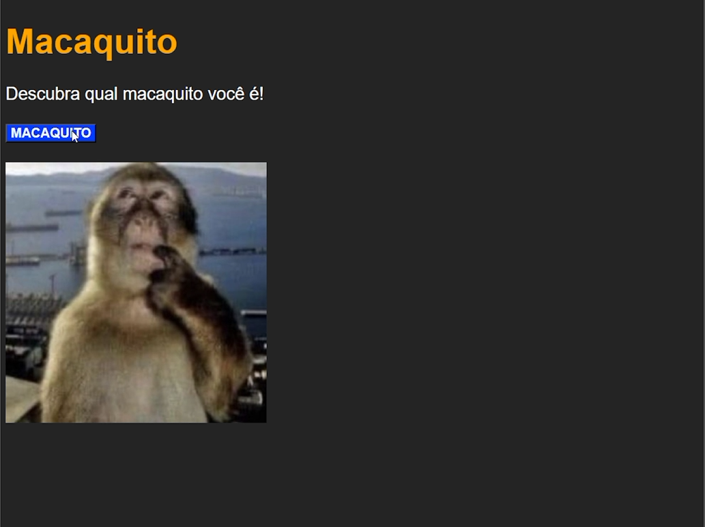

# 🐒 Macaquito

Página simples que sorteia uma imagem de macaco aleatória a cada clique no botão. Projeto de estudo em JavaScript puro (vanilla JS).

## 🎯 Objetivo

Praticar conceitos fundamentais de JavaScript:
- Arrays
- `Math.random()` e `Math.floor()` para gerar números aleatórios
- Manipulação do DOM (`getElementById`, `querySelector`)
- Eventos de clique (`onclick`)
- Alteração dinâmica de atributos HTML (`src`, `style`)

## 🛠️ Tecnologias

- HTML5
- CSS3
- JavaScript (vanilla)

## 🚀 Como rodar

1. Clone o repositório
```bash
   git clone https://github.com/rod-auzier/Macaquitos.git
```
2. Abra o arquivo `Monkey.html` no navegador (ou use a extensão Live Server no VS Code)

## 📸 Preview

